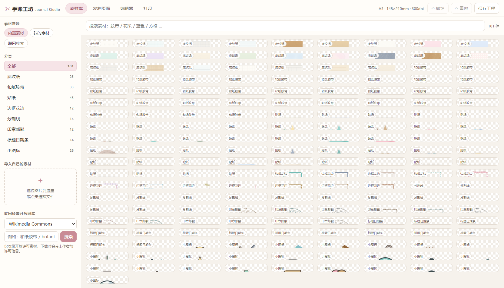
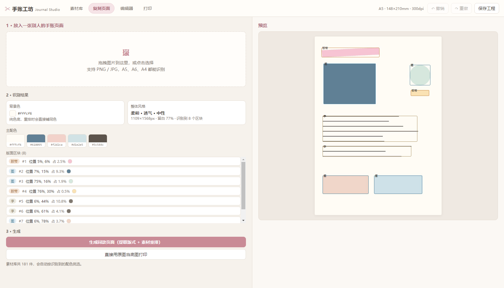
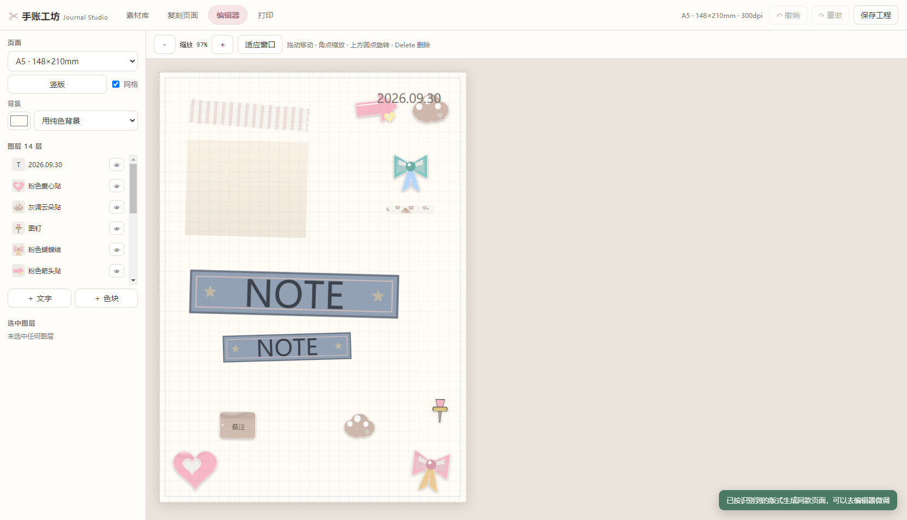
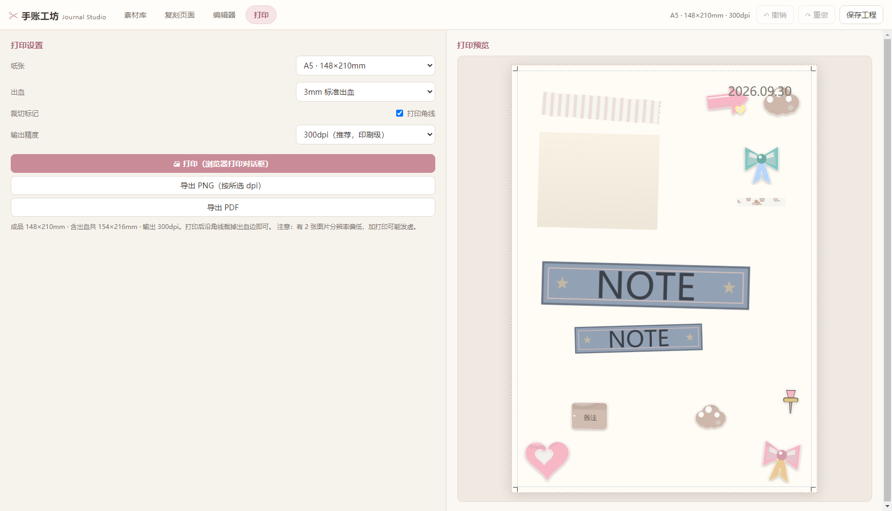

# 手账工坊 Journal Studio



一个跑在你自己电脑上的手账工具。三件事：

1. **收集素材** —— 内置一整套程序生成的原创手账素材（和纸胶带、贴纸、底纹纸、边框、印章、标题条、小图标…），
   可以拖本地图片进来，也可以直接联网检索三个开放许可图库并一键收进自己的素材库。
2. **复刻页面** —— 把别人的手账页面图片丢进去，自动识别背景色、主配色、版面区块，
   再用素材库重排出一张风格一致的页面，然后随便你改。
3. **打印出来** —— A5 / A6 / A4 / B5，300dpi，带出血线和裁切角线，
   可以直接调浏览器打印，也可以导出 PNG / PDF 拿去打印店。

全部本地运行，不上传你的图片，不需要注册，不依赖外网（只有「联网检索素材」需要网络）。

---

## 两种用法，同一套代码

| | 本机版 | 在线版 |
|---|---|---|
| 怎么用 | 双击 `start.bat`，浏览器开 <http://127.0.0.1:8765/> | 直接打开 `https://<你的用户名>.github.io/journal-studio/` |
| 要装东西吗 | 要装 Python + Pillow（`start.bat` 会自动检测） | 什么都不用装，任何电脑/平板/手机浏览器都能开 |
| 分析、渲染在哪跑 | 本机 Python（Pillow） | 你的浏览器里（Canvas） |
| 素材库存哪 | 项目里的 `data/` 文件夹 | 浏览器 IndexedDB（换电脑不同步） |
| 打印质量 | 300 / 600dpi 完全相同 | 300 / 600dpi 完全相同（实测平均像素差 0.24/255） |
| 顶栏徽标 | `本机版` | `在线版` |

**怎么做到同一套代码两边跑**：前端启动时会探测一次 `api/health`——本机服务返回 200 就走 Python 后端；
静态站点返回 404 就自动切到纯浏览器实现（`web/js/render.js` 渲染、`web/js/analysis.js` 分析、
`web/js/store.js` 存素材）。你不需要选，它自己认。

在线版的图片**不会上传到任何服务器**，全部在你的浏览器里处理完就打印/下载。

---

## 快速开始

双击 **`start.bat`** 就行。第一次启动会自动生成内置素材包（约 1–3 分钟），之后每次秒开。

浏览器会自动打开 <http://127.0.0.1:8765/>。关掉那个黑窗口就是退出程序。

手动启动：

```bat
python tools\make_materials.py     :: 只做一次，生成内置素材
python server\server.py            :: 启动服务
```

可选参数：`python server\server.py --port 8800 --no-browser`

---

## 四个标签页怎么用

### 素材库

- **内置素材**：按分类浏览或直接搜中文关键词（「胶带」「花朵」「蓝色」「方格」都能搜）。
  点卡片就加入画布，也可以直接把卡片拖到编辑器的画布上。
  点到 `paper` 分类的底纹纸时，卡片上会出现「设为背景」。
- **我的素材**：你自己导入的图片。左侧「导入自己的素材」支持拖拽或点选，可以一次选多张。
- **联网检索**：选一个图库、输关键词、搜。搜到的结果点「收进素材库」就会下载到本地，
  作者和许可协议一并记录下来。只收录开放许可 / 公有领域素材。

### 复刻页面



1. 把一张别人的手账页拖进左边的方框。
2. 它会告诉你识别到了什么：背景色、整体风格（素雅/柔和/甜系/浓郁 × 极简/透气/适中/满版）、
   主配色条、以及每一个版面区块的位置和类型（图 / 字 / 胶带 / 装饰 / 框）。
3. 两个按钮：
   - **生成同款页面** —— 按识别到的版式，从素材库里挑颜色最接近的素材重新排一张，之后可以随意改。
   - **直接用原图当底图打印** —— 把原图铺满页面。会告诉你等效分辨率，低于 150dpi 会提醒你可能发虚。

### 编辑器



- 毫米坐标画布，所见即所得。纸张可选 A5 / A6 / A4 / B5，可切横竖。
- 拖动移动、八个角点缩放（按住 `Shift` 或拖素材默认锁定比例）、上方圆点旋转（`Shift` 吸附 15°）。
- 拖动时会自动吸附到其它图层的边缘/中线、页面中线和 5mm 边距，并显示蓝色参考线。
- 右侧「选中图层」可以精确输入 X / Y / 宽 / 高 / 旋转角 / 透明度，改文字内容、字号、颜色、字体、对齐，
  还能上移下移、复制、翻转、居中、锁定、删除。
- 快捷键：`Ctrl+Z` 撤销、`Ctrl+Y` 重做、`Ctrl+D` 复制、`Delete` 删除、方向键微调（`Shift` 大步）、`Esc` 取消选择。
- 工程会自动保存到 `data/project.json`，下次打开自动恢复。

### 打印



- 纸张、出血（0 / 3 / 5mm）、裁切角线、输出精度（150 / 300 / 600 dpi）。
- **打印**：调用浏览器打印对话框。页面尺寸按真实毫米写在 `@page` 里，打印时选「实际大小 / 100%」，
  不要选「适应页面」，否则尺寸会不准。
- **导出 PNG / PDF**：服务端按你选的 dpi 重新渲染，和屏幕上看到的完全一致。PDF 可以直接发给打印店。

有出血的时候：把图打印在比成品大的纸上，沿角线裁掉出血边，得到的就是精确的成品尺寸。

---

## 联网素材源

| 源 | 内容 | 授权 |
|---|---|---|
| Wikimedia Commons | 全网最杂，手账类的实拍图、素材图都有 | 各自标注（CC / 公有领域） |
| 芝加哥艺术博物馆 Art Institute of Chicago | 高清艺术品、植物图谱、复古图案 | CC0 |
| 大都会博物馆 The Met | 高清开放藏品，复古花纹极多 | CC0 |
| Openverse | 聚合多站 CC 图库 | 各自标注 |

每个结果都带作者与许可协议，入库时一并保存（`data/library.json` 的 `origin` 字段）。
**商用前请自己再确认一次原始许可**，工具只负责把信息带过来。

> 已知限制：**芝加哥艺术博物馆只能检索、下载图片会失败**——它的图片域名在本机被 Cloudflare 的
> 人机校验拦住（HTTP 403），换 UA 也没用。想用它的图，点结果里的「原图」在浏览器打开后手动另存，
> 再用「导入自己的素材」加进来。其它三个源都能直接下载。

---

## 目录结构

```
journal-studio/
  start.bat              一键启动
  server/
    server.py            HTTP 服务、全部 API、300dpi 渲染引擎
    analysis.py          页面结构 / 配色分析
    sources.py           联网素材源适配器
    pdfwrite.py          极简 PDF 写出器（无第三方依赖）
    store.py             用户素材库落盘
  tools/
    make_materials.py    内置素材包生成器
    probe_sources.py     素材源连通性自检
  assets/materials/      生成好的素材 + manifest.json
  web/                   前端（原生 ES Module，无构建、无 CDN）
  data/                  运行时生成：用户素材与工程
  tests/                 自动化测试
  SPEC.md                模块接口契约
```

## 部署到 GitHub Pages（在线版）

仓库里已经带了 `.github/workflows/deploy-pages.yml`：推上去之后自动构建并发布
`index.html` + `web/` + `assets/` + `docs/`，`server/` `tools/` `tests/` 不进站点。

```bash
# 方式一：用自带脚本（不需要装 git，走 GitHub API）
node tools/deploy-github.mjs --token-file <你的token文件>

# 方式二：装了 git 就走常规流程
git init && git add -A && git commit -m "手账工坊"
git remote add origin https://github.com/<用户名>/journal-studio.git
git push -u origin main
```

推完去 **Settings → Pages → Source** 选 **GitHub Actions**（脚本会自动帮你开）。
首次部署约 1–2 分钟，之后每次 push 自动更新。

`tools/deploy-github.mjs` 需要 token 具备 `public_repo` 与 `workflow` 两个范围。

---

## 测试

```bat
:: ---------- 本地版（Python）----------
python tests\test_materials.py        :: 内置素材包完整性（19 项）
python tests\test_analysis.py         :: 分析引擎与区块类型判定（16 项）
python tests\test_render.py           :: 渲染引擎几何/图层/导出 + 回归（25 项）
python tests\test_sources.py          :: 联网素材源（37 项，离线也能过）

:: ---------- 在线版（纯浏览器模块，用 Node 直接测）----------
node --test tests\test_pdf_js.mjs tests\test_sources_js.mjs   :: 客户端 PDF + 图库适配（40 项）
node tests\test_analysis_js.mjs       :: JS 分析引擎 vs Python 逐字段对拍（17 项）

:: ---------- 端到端（需要服务已经在跑）----------
python tests\e2e_check.py             :: 完整 HTTP 链路 + 健壮性 + 并发（36 项）
node   tests\contract_check.mjs       :: 前后端数据契约（32 项）
node   tests\browser_check.mjs tests\fixtures\sample-page.png      :: 真 Chrome 驱动本机版（37 项）
node   tests\browser_static_check.mjs                              :: 真 Chrome 驱动在线版（20 项）
```

合计 **279 项检查**。

两个浏览器测试都用 Chrome DevTools 协议真跑浏览器：

- `browser_check.mjs`：验证打印真的会输出内容（不是白纸）、预览与导出的文字位置四边差分 ≤0.6mm、
  素材缩略图真实加载、控制台无报错。
- `browser_static_check.mjs`：起一个**没有任何后端接口**的静态服务器（模拟 GitHub Pages），
  验证前端能自动切到静态模式，并在浏览器里独立跑完「素材 → 分析 → 复刻 → 300dpi 渲染 → 打印 → 导出 PDF」，
  最后把 `render.js` 画的图和 Python 渲染引擎的同一请求结果**逐像素对比**（实测平均差 0.24/255）。

截图写到 `tests/_artifacts/`（仅测试产物，可随时删）。

`VERIFY.md` 是上线前的**独立对抗性验证报告**（另一个 agent 只读复核，找出 6 个严重问题与 15 个次要问题），
所有问题均已修复并补了回归测试；原始报告保留未删改，顶部附了修复对照表。

## 常见问题

- **提示「还没有内置素材」**：运行 `python tools\make_materials.py`，或直接双击 `start.bat`。
- **打印出来尺寸不对**：打印对话框里把缩放改成 100%，关掉「适应页面 / Fit to page」。
- **联网检索搜不到**：换个源或换关键词；公司网络可能挡住了部分图库。离线时其它功能不受影响。
- **端口被占用**：`python server\server.py --port 8800`。
